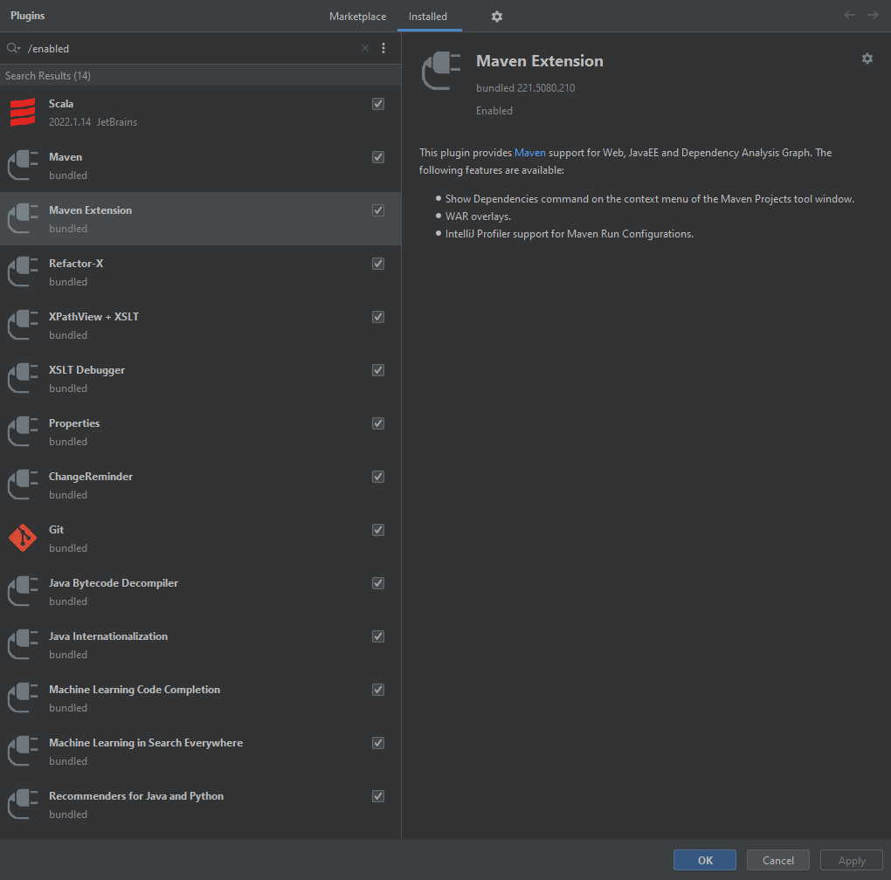

## IntelliJ for Scala
* install Git, Scala, JDk8

* Go to Settings -> ProjectStructure -> choose SDK = 1,8
* * Go to Settings -> Project Structure -> Project Settings -> Libraries -> Add -> Scala SDK
* Go to Settings -> Project Structure -> Project Settings -> Modules and Mark Directory:

1. **app** → as Sources
2. **conf** → as Resources
3. **test** → as Tests
5. **target** → as Generated Sources

## Appearance
* enable Drag and drop with ALT
* Mainmenu + Navigation + Members in Navigation + StatusBAr

## Keymap
* Window/editor tab/reopened closed - cmnd+shift+T

## General
* change font size with wheel
* turn off drag and drop
* show virtual space at bottom
* ensure line feed at file end on Save
* turn off breadcrumbs
* turn off code folding

## editor tabs
* tab limit -> 20

## inspections
* turn off HTML, JSON
* turn off Emmet

## custom VM options
```
-Dproject.tree.structure.show.url=false
-XX:MetaspaceSize=128M
-XX:MaxMetaspaceSize=512m
-XX:+AlwaysPreTouch
-Xms128m
-Xmx2048m
-XX:ReservedCodeCacheSize=512m
-XX:+UseG1GC
-XX:+UseStringDeduplication
-XX:AutoBoxCacheMax=20000
-ea
-Dsun.io.useCanonCaches=false
-Dsun.awt.keepWorkingSetOnMinimize=true
-XX:+HeapDumpOnOutOfMemoryError
-XX:-OmitStackTraceInFastThrow
```

## Plugins

